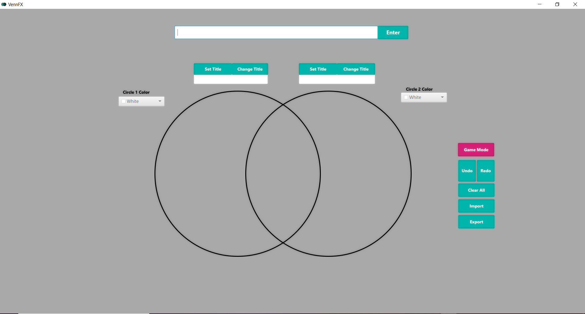

<p align="center">
  <h1>VennFX</h1>
</p>


<p align="center">
  
</p>

## Run Instructions
### Latest Release
1. Navigate to the latest release and download the included jar file (https://github.com/erick576/VennFX/releases).
2. Run VennFX.jar with ``` java -jar VennFX.jar ```

*For MacOS users, if you recieve and error ```"VennFX.jar" can't be opened because it is from an unidentified developer.``` you must update your system settings to allow non-AppStore applications to run:
1. System Preferences -> Security & Privacy -> (Unlock Window) -> Allow apps downloaded from: (Select Anywhere)
2. System Preferences -> Java -> Security -> (Select Medium)

### Build from Source
1. ```gradlew clean build```
2. Navigate to *build/libs/*
3. Run *VennFX.jar* by double-clicking on it or running ```java -jar VennFX.jar```

## Important Folders

[Documentation](https://github.com/erick576/VennFX/tree/master/Documentation): Contains all documents (e.g. user manual)

[VennFX](https://github.com/erick576/VennFX/tree/master/VennFX): Contains the application source code

NOTE**: **Please Read the User Manual If Not Sure How To Use Any Function In The Applicaton**
